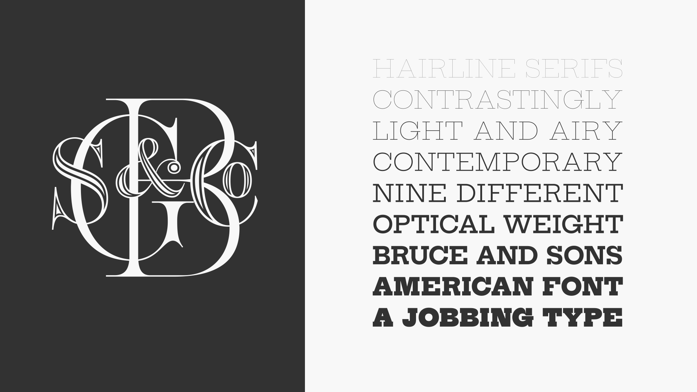

# Hepta-Slab

## Description
Hepta Slab is a slab-serif revival based on specimens of antique genre types from Bruce and Co., primarily Antique 307. The family consists of 9 weights with the extremes intended for display use and the middle weights for setting text.

## Features
Features include lining numerals, oldstyle numerals, case sensitive punctuation, fractions, superior and inferior numerals as well as multiple stylistic alternates.

## License
Hepta Slab is licensed under the SIL Open Font License v1.1

